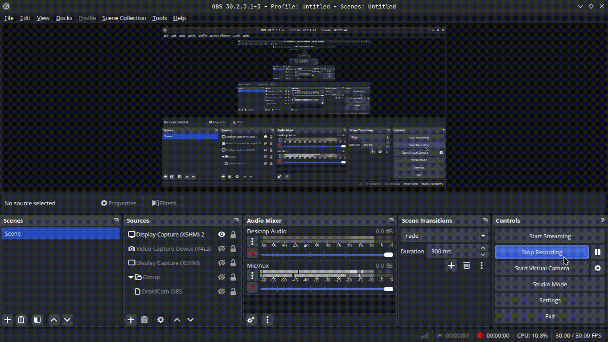

# Diesel Migration

Manage [Diesel ORM](https://diesel.rs/) migrations directly from VS Code — create, run, and revert migrations without leaving your editor.


## Features

- Point the extension at your project's `diesel.toml` and drive the Diesel CLI from the Command Palette or the Explorer context menu.
- Right-click `diesel.toml` to configure the extension, print the schema, or reset the database.
- Right-click your `migrations` folder to generate, run, revert, redo, or revert-all migrations.
- Reload the extension without restarting VS Code if your configuration changes.

## Requirements

- The [Diesel CLI](https://diesel.rs/guides/getting-started) must be installed and available on your `PATH`:
  ```bash
  cargo install diesel_cli
  ```
- A Diesel project with a `diesel.toml` file (created via `diesel setup`).

## Getting Started

1. Open a folder containing a Diesel project (one with a `diesel.toml` file).
2. Right-click `diesel.toml` in the Explorer and choose **Diesel Migration: Set as diesel toml path** to point the extension at your configuration.
3. Once set, right-clicking `diesel.toml` again reveals additional actions: **Print schema**, **Reset database**, and **Generate migration**.
4. Right-click your `migrations` folder to run, revert, redo, or generate migrations, or revert all migrations at once.

All commands are also available from the Command Palette (`Ctrl+Shift+P` / `Cmd+Shift+P`) — search for **"Diesel Migration"**.

## Commands

| Command                                   | Description                                                                                       |
| ----------------------------------------- | ------------------------------------------------------------------------------------------------- |
| `Diesel Migration: Set Diesel Toml Path`  | Configure the path to your project's `diesel.toml`.                                               |
| `Diesel Migration: Reload Extension`      | Reload the extension, picking up any configuration changes.                                       |
| `Diesel Migration: Setup Migration`       | Run `diesel setup` — creates the database, migrations table, and default `diesel.toml` if needed. |
| `Diesel Migration: Reset database`        | Drop and recreate the database, then re-run all migrations.                                       |
| `Diesel Migration: Generate migration`    | Create a new migration (`up.sql` / `down.sql`).                                                   |
| `Diesel Migration: Run migration`         | Apply all pending migrations.                                                                     |
| `Diesel Migration: Revert migration`      | Roll back the most recently applied migration.                                                    |
| `Diesel Migration: Revert all migrations` | Roll back every applied migration.                                                                |
| `Diesel Migration: Redo migration`        | Revert then re-apply the most recent migration.                                                   |
| `Diesel Migration: Print schema`          | Regenerate `schema.rs` from the current database schema.                                          |

Some of the commands above also have context-menu-only variants (e.g. **Set as diesel toml path**, context-menu **Reset database**, **Print schema**, and **Generate migration**) that are triggered by right-clicking `diesel.toml` in the Explorer, rather than through the Command Palette.

## Explorer Context Menu

The extension adds actions to the Explorer's right-click menu based on what you click:

**Right-click `diesel.toml`:**

- If the extension isn't yet configured: **Set as diesel toml path**
- Once configured: **Print schema**, **Reset database**, **Generate migration**

**Right-click your `migrations` folder:**

- **Run migration**
- **Redo migration**
- **Revert migration**
- **Generate migration**
- **Revert all migrations**

> Note: the "migrations" folder actions currently match on a folder literally named `migrations`. If your Diesel project uses a custom migrations directory name, use the Command Palette equivalents instead.

## Extension Settings

This extension contributes the following setting:

| Setting                       | Type     | Default | Description                                                                                 |
| ----------------------------- | -------- | ------- | ------------------------------------------------------------------------------------------- |
| `diesel-migration.dieselToml` | `string` | `""`    | Path to `diesel.toml`, relative to the workspace root, if it isn't in the default location. |

## Known Limitations

- Explorer context-menu actions for the migrations folder rely on a static folder name match (`migrations`) rather than your configured migrations directory, due to a VS Code limitation around dynamic `when`-clause conditions.
- Multi-root workspaces are not currently supported — the extension operates against a single workspace root.

## Release Notes

### 0.0.1

Initial release: configure `diesel.toml`, and generate, run, revert, redo, and revert-all migrations from the Command Palette or Explorer context menu.

---

**Enjoy!**
